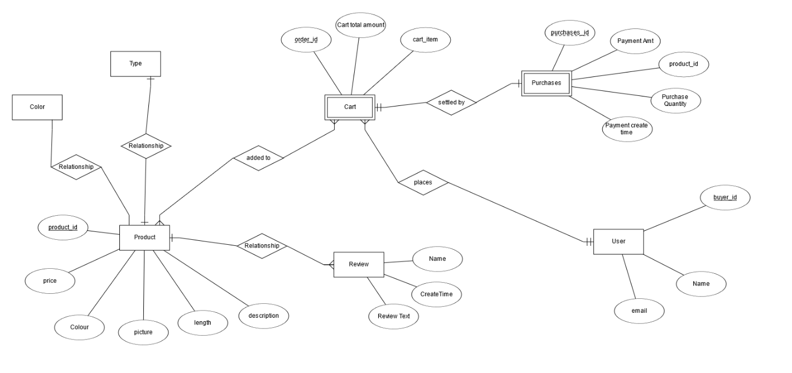
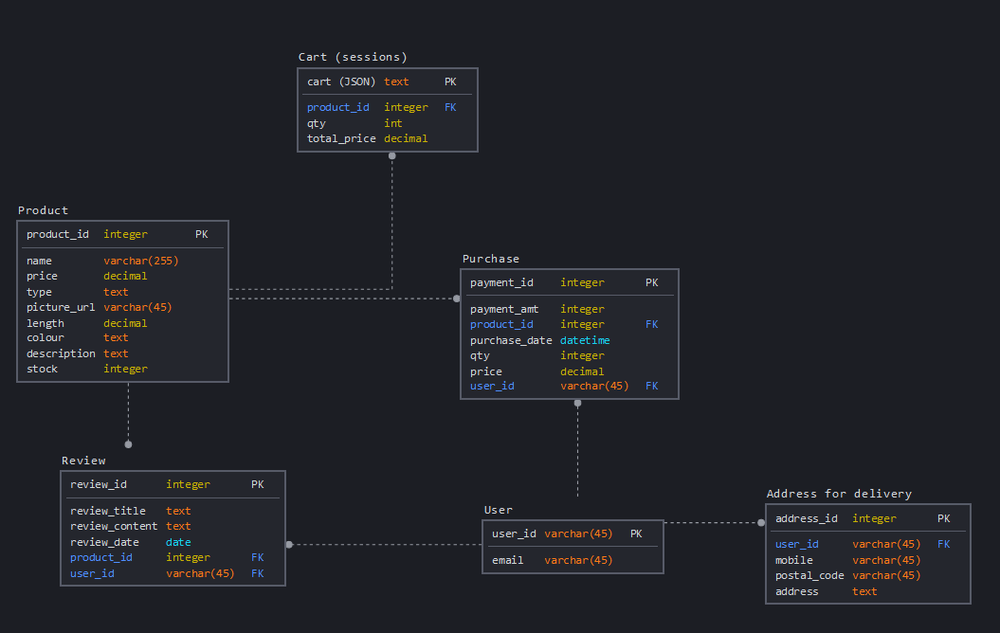
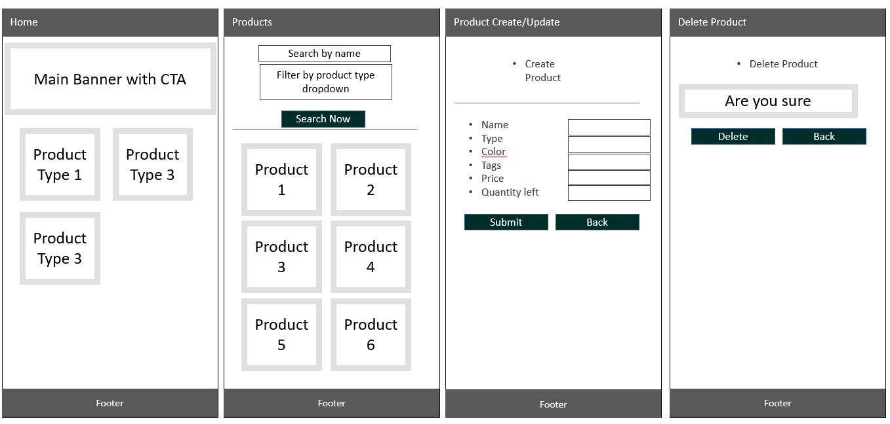
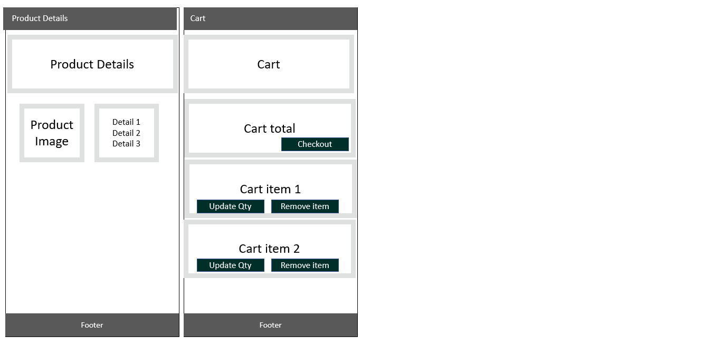

# Pampas Collective SG's Store


# 1. Background & Objective
## Background / Problem Statement
- The store administrator/owner is currently selling via South East Asia's largest e-commerce platform [Link to Shopee.sg store](https://shopee.sg/melodyamanda7?categoryId=11&itemId=3760378194)
- Need to have own store - similar to most other businesses based in singapore, to build credibility and online presence.

Sample of stores that other small businesses have

* [IvenBetta](https://ivenbetta.com/)
* [Petitefleur](https://www.petitefleursg.com/)


## Objective
* Design and build a store for Pampas Collective SG
* Pampas Collective needs
    1. Mobile responsive store front-end with landing page
    2. Checkout and payment function
    3. Display products in their inventory
    4. Database to store products/transactions
    5. Different access levels to buyers vs store owner

<br>

# 2. Demo (Heroku)
Site is published via Heroku and can be viewed [here](https://pampas-collective.herokuapp.com/)

<br>

# 3. Technologies Used
- HTML 
- CSS
- Bootstrap 4
- Django
- Django All Auth
- Django Cripsy Forms plugin
- Javascript
- [Toastr](https://github.com/CodeSeven/toastr) (JS notifications)
- Stripe (for Handling Checkout)
- [UploadCare](https://uploadcare.com/) (for image upload and cloud storage) 

## 3.1 Dependencies installed with pip (python's package manager)
- django
- django-allauth
- django-crispy-forms
- pyuploadcare
- python-dotenv
- stripe
- dj_database_url

## 3.1.1 For deployment to Heroku
- pip3 install gunicorn
- pip3 install psycopg2
- pip3 install Pillow
- pip3 install whitenoise 

## 3.2 Python Libraries used in `views.py`
Below are the general libraries used to generate the different view functions in `views.py`
```
from django.shortcuts import (render,
                              redirect,
                              reverse,
                              get_object_or_404)
from django.contrib import messages
from django.db.models import Q
```

<br>

# 4. The Goals: User Stories or (JTBD) Jobs-to-be-Done
For the small time e-commerce business store owner selling pampasgrass:
```
1. I want to be able to list my products, so that users can see the pictures and the price of my items - perform standard CRUD for all my product listings
2. I want to be able to categorise my products based on certain type groups
3. I want my store to be mobile-responsive so that users can shop on the go
4. I want to be able to collect payment from users via the store
5. I want to be able to get delivery addresses for each successful purchase
6. I want to be users to be able to review the products on the website
7. I want to use my store for inventory management, so that I don't let buyers buy what I don't have in my inventory
```

For the buyers
```
1. I want to be able to search and sort through the products
2. I want to be able to see how many of each item has left in stock
3. I want to be able to pay without hassle
4. I want to be able to leave a review about the products on the website.
```

<br>

# 5. Key Features
## 5.1 Feature List
|# | Name          | Main User | Description   |     
| -| ------------- |-------------| -------------|
|1 | Landing page | Buyers |Learn about the company, view different product categories|
|2 | Product page | Buyers, Seller | View stock and checkout products|
|3 | Search function | Buyers | Simple search via name, and dropdown for product types|
|4 | Product details | Buyers | to view more details of each product |
|5 | Reviews Creation | Buyers | Create reviews for each product |
|6 | Product Create, Update, Delete | Seller | Update `models` without needing django admin |
|7 | Access controls | Seller | Only logged in users, and the whitelisted `admin` user can view certain functions (e.g. product Create Update and Delete) |

<br>

# 6. Database Design
Database design started with ER diagram, and then graduated to a full-blown Logical Schema Diagram to represent the `models` to build in `django`

## 6.1 Entity Relationship Diagram AKA ER Diagram


ER diagram was first used to have a high level view of all entities that might be involved in designing a store

## 6.1 Logical Schema Diagram


Logical schema was developed to have the following tables:
1. Products
2. Reviews of each product
3. User - from `django` as a default
4. Purchase - historical payments
5. Address - details of delivery address

`Cart` is technically not a database, since it makses use of `sessions` but is added to the diagram for completeness, since it serves as a holding space for inventory when users add to cart.


# 6. Prototyping
Simple Prototyping was done directly using MS Powerpoint to mock-up the features of the website.



Online Web store Reference was taken from
- [IvenBetta.com](https://ivenbetta.com/) - for landing pages, product categories, mobile responsivness
- [https://shopee.sg/](https://shopee.sg/) - Accounts handling, storage of addresses, cart layout

## 6.2 Actual Final Design
The final design aims to provide a solution to all user stories listed in `section 4 The Goals: User Stories or (JTBD) Jobs-to-be-Done` 


### 6.2.1 Search Section


```
1. Insert which user story was fulfilled by this feature
```

## 6.3 Colour
Bootrap's dark theme was used
```
class= "btn-dark"
class= "navbar-dar"
```
<br>

# 7. Detailed Features Write-up
## 7.1 Search Bar
- how was each implemented?

## 7.1.1 Search Bar Validation
- simple if function to prevent empty string from being processed


# 8. External Frameworks
## 8.1 Boostrap 4 Implemetation
- Bootstrap 4 was used for re-building the website in a responsive, mobile-first manner. You can access Boostrap 4 resouces [here](https://getbootstrap.com/docs/4.5/getting-started/introduction/)

The below `code snippets` were added to the HTML in `base.template.html` to invoke the boostrap framework
```
<!-- Bootstrap CSS -->
<link rel="stylesheet" href="https://stackpath.bootstrapcdn.com/bootstrap/4.4.1/css/bootstrap.min.css" integrity="sha384-Vkoo8x4CGsO3+Hhxv8T/Q5PaXtkKtu6ug5TOeNV6gBiFeWPGFN9MuhOf23Q9Ifjh" crossorigin="anonymous">

<!--JQuery -->
<script src="https://code.jquery.com/jquery-3.4.1.slim.min.js" integrity="sha384-J6qa4849blE2+poT4WnyKhv5vZF5SrPo0iEjwBvKU7imGFAV0wwj1yYfoRSJoZ+n" crossorigin="anonymous"></script>

<!-- Popper JS -->
<script src="https://cdn.jsdelivr.net/npm/popper.js@1.16.0/dist/umd/popper.min.js" integrity="sha384-Q6E9RHvbIyZFJoft+2mJbHaEWldlvI9IOYy5n3zV9zzTtmI3UksdQRVvoxMfooAo" crossorigin="anonymous"></script>

<!-- Bootstrap min JS -->
<script src="https://stackpath.bootstrapcdn.com/bootstrap/4.4.1/js/bootstrap.min.js" integrity="sha384-wfSDF2E50Y2D1uUdj0O3uMBJnjuUD4Ih7YwaYd1iqfktj0Uod8GCExl3Og8ifwB6" crossorigin="anonymous"></script>
```

## 8.2 Toastr Implementation
- Toastr was used instead of just flash messages displayed as a HTML div

The below `code snippets` were added to the HTML in `base.template.html` to be able to use toastr
```
<!-- Toastr CSS -->
<link rel="stylesheet" href="https://cdnjs.cloudflare.com/ajax/libs/toastr.js/latest/toastr.min.css">

<!--JQuery -->
<script src="https://code.jquery.com/jquery-3.6.0.min.js" integrity="sha256-/xU+3OJU5yExlq6GSYGSHk7tPXikynS7ogEvDej/m4=" crossorigin="anonymous"></script>

<!-- Toaster JS -->
<script src="https://cdnjs.cloudflare.com/ajax/libs/toastr.js/latest/toastr.min.js"></script>

```

### 8.2.1 Toastr Messages implementation
Reference was taken from [this stackoverflow page](https://stackoverflow.com/questions/45004245/how-to-use-toastr-in-django-for-success-or-fail-message) on how to implement toastr with django

```

    
    
    <script type=text/javascript>
        toastr.{{message.tags}}('{{ message }}')
    </script>
    
    <script type=text/javascript>
        toastr.{{message.tags}}('{{ message }}')
    </script>
    
    <script type=text/javascript>
        toastr.{{message.tags}}('{{ message }}')
    </script>
    
    <script type=text/javascript>
        toastr.{{message.tags}}('{{ message }}')
    </script>
    
    

```

Toastr options comes from the [toastr demo page](https://codeseven.github.io/toastr/demo.html)
```
// Toaster options
toastr.options = {
    "closeButton": true,
    "debug": false,
    "newestOnTop": false,
    "progressBar": false,
    "positionClass": "toast-bottom-full-width",
    "preventDuplicates": true,
    "showDuration": "300",
    "hideDuration": "1000",
    "timeOut": "5000",
    "extendedTimeOut": "1000",
    "showEasing": "swing",
    "hideEasing": "linear",
    "showMethod": "fadeIn",
    "hideMethod": "fadeOut"
}
```

<br>

# 9. Environment setup

## 9.1
- The following were used in the .env file during development. 
- For Heroku, these are stored under Heroku settings > Config vars
- These values were then passed to `settings.py` via `os.environ.get()`

```
# for uploadcare:
UPLOADCARE_PUBLIC_KEY
UPLOADCARE_SECRET_KEY

# for stripe payment
STRIPE_PUBLISHABLE_KEY
STRIPE_SECRET_KEY
STRIPE_SUCCESS_URL
STRIPE_CANCEL_URL
STRIPE_ENDPOINT_SECRET

# linking to database on heroku
DATABASE_URL

# sending email via gmail
EMAIL_HOST_PASS
EMAIL_HOST_USER
TEST_EMAIL
```


# 10. Content Credits
## Hero Banner
- Credits to magazinec.com https://magazinec.com/wp-content/uploads/2019/07/Hero-9.jpg 

## Pamspas Product & Images
- Credits to my deal wife melody amanda, and her DIY photoshoots of her products in the basement of our marital home.

<br>

# 12. Testing
## 12.1 Code Validation using Code Validators
- `static/style.css` was validated using the W3C Jigsaw validator ([Link](https://jigsaw.w3.org/css-validator/))
  - No issues were found with `style.css`
  
- all `.html` files in `templates` was validated using the W3 Nu HTML Validator ([Link](https://validator.w3.org/nu/#file))

## 12.2 PEP8 Style guide for Python
All code in `.py` files comply with `PEP8` [Style guide](https://www.python.org/dev/peps/pep-0008/) 

This is ensured by making sure no callouts from gitpod python linter are present in `app.py` and that no lines of code in `app.py` exceed 79 Characters

## 12.2 Testing and Bug Fixes (Test Case Table)
Manual testing was conducted to ensure `Usability`, `Functionality` and `Responsiveness`

| # |Type| Test       | Result           | Fix/Expected Result  |
|-- |--|------------- |:-------------:| -----:|
|1  |Functionality| Search bar supposed to display matched words. regardless of case | Displayed product names that matched the searched string | All OK |
|2  |Usability| Enter random string of text which doesn't match into search bar | returns no products since there's no match | All OK |
|3  |Functionality| Display of all products | show all product cards on front end for `show_product` | Products were displayed, but did not have `cm` and `$` in the client side display. template was adapted to show the right symbols for each field |
|5  |Functionality| Validation of empty input for `create` & `update` for product | Pop up messages for empty fields and field with type that don't match `models.py` | All OK
|6  |Functionality| Cart needs to display `grand total price` of all items in cart | Float resulted in trailing digits like `25.XXXXXXX` |used `round(x,2)` to maintain to 2 decimal places |
|7  |Usability| `@login` decorator testing. All cases where the decorator `@login` apprears above the `view` function should block the user from accessing the view. | User was forced to login for `products/create` and `update` as these functions are meant for administrators only and not generic users | All OK |
|8  |Usability| Blocking users who hare not `admin` | users are shown a toastr message `Access is Denied` | All OK |
|9  |Usability| Nav bar toggle should work when screen size is `small` | Navbar toggle was not working. Background of the navbar toggle was transparent | Custom css in `static/style.css` was causing the div to be limited to `70px`. Removed that custome css and now all OK |
|10 |Functionality| Delete products  | product should be gone from products `db` | All Ok |
|11 |Functionality| loading static files with `` | Pictures, `css` from static were loaded ok without problems. | All Ok |
|12 |Responsiveness| Test screen size | Tested using Firefox to mock iPhone X, Samsung S9| All Ok. Bootstrap responsiveness is as expected |
|13 |Functionality & Responsiveness| Deployment test to heroku | clicked on heroku link in mobile phone and tested if pages were working correctly and responsively | All Ok |
|14 | Functionality |  Stripe checkout should have callback to local endpoint `STRIPE_ENDPOINT_SECRET` | stripe checkout did not reach callback endpoint | trouble shooting revealed that `metadata` was not being passed overproperly (client side) | Meta data was fixed by using the following format `metadata={"all_product_ids": json.dumps(all_product_ids)},` | 
|15 | Functionality | `Checkout success` should redirect to `Checkout success` page after receiving call back from `Stripe`. |Redirect went to correct template | All OK| 
|16 | Functionality |  `Checkout Cancelled` should redirect to `Checkout Cancelled` page after receiving call back from `Stripe`. |Redirect went to correct template | All OK| 
|17 | Functionality | `Purchases` should be stored in `Purchases Model` after Checkout is successful | Failed to store in Purchases | Did not migrate after creating Purchases model. Subsequent attempts all OK | 
|18 | Usability | Instances of `product.name` being rendered on front end template should be linked to `product-details.template.html | Links are working propery | All OK |


<br>

# 14. Deployment
Deployment flow is entirely credited to our instructor in Singapore, Mr Paul Chor's instructions document at [this link](https://docs.google.com/document/d/1TYCxMEcnQKs8gs8IUBX2uXsFcZEqRP2BtNzGTuPM-rY/edit?usp=sharing)

## 14.0 Things to check 
1. set `debug=False`!!! since we are going into production and no longer in development
2. Ensure that `settings.py` allowed hosts do not have `*`
3. Do not upload the `.env` file

## 14.1 Preparation
Before the site goes `live` the following elements are checked gitpod's native browser preview via open port `8000`. This is done by executing command in terminal `python3 manage.py runserver`
- Fulfillment of Learning objectives from 'Code Insitutes' Assessment Handbook`
- Check all code linters and validators are clear
- Check that all images src are not broken
- Test viewport dynamic resizing for android (Samsung S9) and iOS (iPhone X/XS)
- Check Create, Read, Display, Update, Delete functions for Product
- Check all `forms.py` and form validation correspond to the underlying `models.py`
- Ensure all entries and details from `db` are properly rendinging
- Check navbar functionality and responsiveness

## 14.2 Deployment Steps to Github
Deployment was done via github pages.

After ensuring that final commit and push via Visual Studio Code was done

1. Check if the contents have been successfully pushed to repository at https://github.com/Malrhis/project3

## 14.3 Deployment to Heroku
1. Login to `heroku` on terminal using `heroku login -i`
2. Check `remotes` using `git remote -v`
3. Ensure that `requirements.txt` is updated correctly
4. perform `git push heroku master`
5. Setup environment variables 
6. Check that environment variables can be seen in heroku app settings under `config vars`
5. Verify that site has been published to Heroku dashboard in Heroku [Link](https://dashboard.heroku.com/apps/pampas-collective)
7. Click on [Published URL](https://pampas-collective.herokuapp.com/)
8. perform another round of validation based on `#14.1 Preparation` but this time in `heroku` instead of `gitpod browser preview`

## 14.3 Production
In the event that `#14.1`, `#14.2` & `#14.3`  are cleared, the site can then be considered to be in production. 
If not, repeat to ensure that deploying of code is error free and is working in `Github repo` and `heroku`.

<br>

# 15. Acknowledgements
- Mr Malcolm Yam - Bootrap instructor
- Mr Arif Rawi - HTML and CSS instructor
- Mr Paul Kunxin Chor - Who guided us on python, Jinja2, flask, mongo, pymongo
- Mr Ace Liang - Teaching assistant, who supported this project by holding consultation sessions.
- Ms Melody Amanda - Wife, content provider, entrepreneur